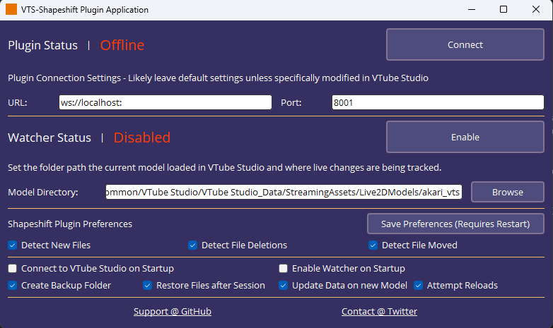

# VTube Studio Shapeshift Plugin
Plugin/Application to support dynamic model loading during live raw model modifications.
If you like to modify your live models and have it seamlessly update VTube Studio, you can use this plugin to simplify that process!
Can also be extended to hook to external processes and plugins to trigger live model updates.

## Table of Contents
1. [About the tool](#about)
2. [Installation](#install)
3. [Usage](#use)

## 1. About 
VTS-Shapeshift is a lightweight python application/plugin that uses a “watcher” to keep track of file changes of the currently loaded VTube Studio model. This can be then used to send automatic updates to Vtube Studio to update the current model. Get rid of annoying macros, or even extend it with other streaming integration applications for more unique stream interactions!
Check out a quick start and preview of it in-action [here!](https://youtu.be/hMnjTp1Ll6M)

## 2. Installation 
Go to the [releases](https://github.com/randypanopio/VTS-Shapeshift/releases/) page of this repo, download the executable which will run a standalone application version of this app. If you are tech savvy, I would also highly recommend you to compile the whole application using something like [PyInstaller](https://pyinstaller.org/en/stable/)

## 3. Usage 
### i. Initial Setup
   1. Ensure that VTube Studio is open.
   2. Click “Connect” to enable the plugin within VTube Studio.
      * You can modify the connection settings if you are using a custom routing. The default URL and Port can be left to its default value if you aren't sure.
   3. Grant the plugin permissions within VTube Studio.
      * You only need to do this once, and authorization can be maintained for future use.
   4. Pass the directory (folder path) of your active VTube Model in the “Model Directory” field. You must update the directory manually if you are to change models. The plugin will disable its watcher when it detects a model change, however it cannot change directories due to maintaining privacy. (The plugin does not know any local directories, only socket connection to VTube Studio, and the local files granted)
   5. Click “Enable” to enable the watcher and allow the plugin to begin sending model updates whenever it detects changes to the model files!
      * You can also click the same button “Disable” to disable the watcher at any time.
      * The plugin will automatically disable itself if the loaded model has been changed. Upon enable, it will keep track of the currently loaded model

### ii. Settings

   1. Plugin Connection Settings
      * i. URL - websocket url connection.
      * ii. Port - Default VTube Studio Port
   2. Watcher Settings
      * i. Model Directory - Folder path of your active VTube Model. Highly recommended you pass in the directory of the top level folder of your model. The plugin will only keep track of files changed in that folder, but will also keep track of your live model.
   3. File Change Preferences
The plugin can track different changes, it will track file changes, but can be extended to also detect new files, deleted files, and moved files (including renames).
   4. Plugin Preferences
      * i. Connect to Vtube Studio on Startup - automatically connects the plugin to Vtube Studio, you will need to have authenticated the plugin at least once, and must have Vtube Studio open to use this setting.
      * ii. Enable Watcher on Startup - automatically “enable” the watcher as soon as the application connects to Vtube Studio. It will use the last passed model directory to watch.
      * iii. Create Backup folder - Creates a copy of the passed model directory upon launch of the plugin. It will keep a copy of the model before the session. It does NOT maintain copies of your original model if it was modified during a previous session, it will only keep track of your LAST session (Highly recommended you enable)
      * iv. Restore Files after Session - Reverts the model to the original files during the session. Must have “Create Backup folder” enabled
      * v. Update Data on new Model - Automatically updates the plugin with the new model. However it CANNOT automatically change directories to maintain privacy access granted by the application. You MUST change the directory manually.
      * vi. Attempt Reloads - Allow the application to continue to attempt talking to VTube Studio when it fails to communicate. * It will only attempt to a reasonable limit before completely stopping.

      * Plugin settings are stored locally in a “plugin_config.json” file.
